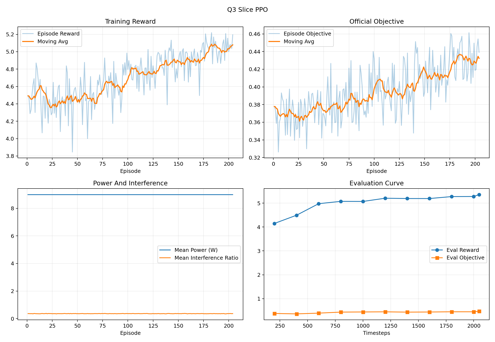

# 5G Network Slicing Optimization

Paper-oriented rebuild of the first three contest questions into a single optimization and reinforcement learning project.

## At A Glance

- Question 1: static single-base-station RB slicing as an exact small-scale integer allocation problem.
- Question 2: dynamic single-base-station scheduling as a finite-horizon MPC pipeline in `q2_mpc.py`.
- Question 3: multi-base-station slicing and power control under inter-cell interference as a hierarchical RL pipeline in `q3_hierarchical_rl.py` and `q3_sb3.py`.
- All experiments use the original repository Excel data in `channel_data等2个文件/`, `channel_data等2个文件(1)/`, and `BS2等5个文件/`.

## Featured Result

- Current tracked Q3 hierarchical PPO run reaches `objective = 0.4851` in combined evaluation.
- The earlier numpy hierarchical actor-critic baseline reaches `best_eval_objective = 0.4553` in a short run.
- The tracked slice-layer PPO run contains `204` training episodes and `11` evaluation checkpoints.



Full metrics, evidence sources, and caveats are summarized in [docs/Q3_RESULTS.md](docs/Q3_RESULTS.md).

## Why This Repository Matters

- It keeps the contest's real constraints instead of replacing them with a toy RL benchmark.
- It separates modeling assumptions, official evaluation logic, and training proxies.
- It shows a clean research progression: exact optimization -> MPC -> hierarchical RL.
- It is reproducible from the project root with explicit scripts, data sources, and tracked showcase assets.

## Repository Map

- `背景信息/`: contest statement, appendix, modeling notes, references, and earlier materials.
- `channel_data等2个文件/`: Question 1 data and original materials.
- `channel_data等2个文件(1)/`: Question 2 data.
- `BS2等5个文件/`: Question 3 data.
- `q2_mpc.py`: finite-horizon MPC implementation for Question 2.
- `q3_hierarchical_rl.py`: Question 3 environment and lightweight numpy RL baseline.
- `q3_sb3.py`: Question 3 SB3/PyTorch hierarchical PPO entry point.
- `docs/Q3_RESULTS.md`: tracked result snapshot for GitHub display.
- `docs/assets/`: tracked images that should stay visible on GitHub even though `outputs/` is ignored.

## Important Modeling Notes

- This repository currently focuses on Questions 1 to 3 only.
- Question 3 follows the contest's `100 ms` resource reconfiguration cycle and `1 ms` service execution cycle.
- In the current Question 3 implementation, the serving BS is assigned as the nearest micro base station at task arrival time. This is an explicit modeling assumption because access optimization is outside the current scope.
- `outputs/` is intentionally ignored by git. Only selected showcase artifacts are copied into `docs/assets/`.

## Quick Start

Create the environment and install dependencies:

```bash
python3 -m venv .venv
source .venv/bin/activate
pip install -r requirements.txt
```

Run the current Question 3 hierarchical PPO workflow:

```bash
./.venv/bin/python q3_sb3.py train-slice \
  --device cpu \
  --total-timesteps 2000 \
  --eval-freq 200 \
  --eval-episodes 1 \
  --model-out outputs/q3_sb3/q3_slice_ppo.zip \
  --metrics-out outputs/q3_sb3/q3_slice_metrics.json
```

```bash
./.venv/bin/python q3_sb3.py train-power \
  --device cpu \
  --slice-mode model \
  --slice-model-in outputs/q3_sb3/q3_slice_ppo.zip \
  --total-timesteps 2000 \
  --eval-freq 200 \
  --eval-episodes 1 \
  --model-out outputs/q3_sb3/q3_power_ppo.zip \
  --metrics-out outputs/q3_sb3/q3_power_metrics.json
```

```bash
./.venv/bin/python q3_sb3.py evaluate \
  --slice-mode model \
  --slice-model-in outputs/q3_sb3/q3_slice_ppo.zip \
  --power-model-in outputs/q3_sb3/q3_power_ppo.zip \
  --eval-episodes 1 \
  --metrics-out outputs/q3_sb3/q3_combined_eval.json
```

To continue from an existing checkpoint, add `--init-model <checkpoint.zip>` to `train-slice` or `train-power`.

## Safe GitHub Publish Flow

This repository currently has no remote configured. To publish the cleaned showcase version without accidentally committing unrelated local edits:

```bash
git remote add origin <your-github-repo-url>
git add .gitignore README.md requirements.txt q2_mpc.py q3_hierarchical_rl.py q3_sb3.py docs/Q3_RESULTS.md docs/assets/q3_slice_convergence.png
git commit -m "Package Q3 hierarchical RL project for GitHub"
git push -u origin HEAD:main
```

If you also want another machine to continue training from your current checkpoints, share the `outputs/q3_sb3/` checkpoint files separately or add them with `git add -f`.
